# Práctica Docker

Práctica de contenedores con Alpine. He usado la imagen alpine:3.22, con la versión
fija para no usar latest, que es una etiqueta que va cambiando.

## 1. Descargar la imagen

Ponemos "docker pull alpine:3.22" y esperamos.

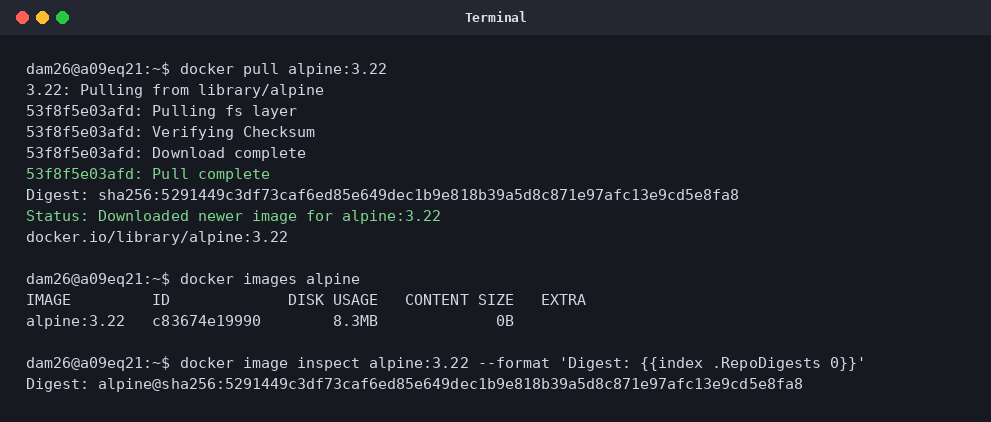

Esto solo descarga, no crea ningún contenedor. Con "docker images" comprobamos que
sale alpine:3.22 ocupando 8.3 MB.

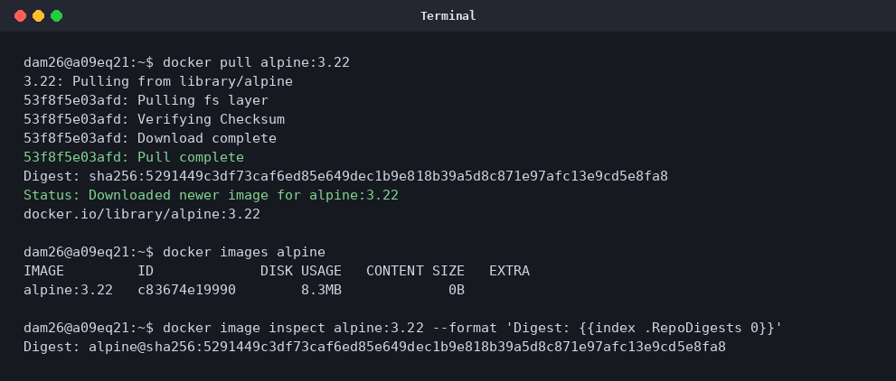

## 2. Crear un contenedor sin nombre y sin arrancarlo

Ponemos "docker create alpine:3.22 sh" y nos devuelve un id.

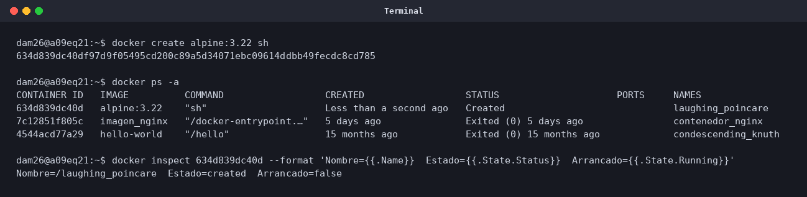

Después lo miramos con "docker ps -a".

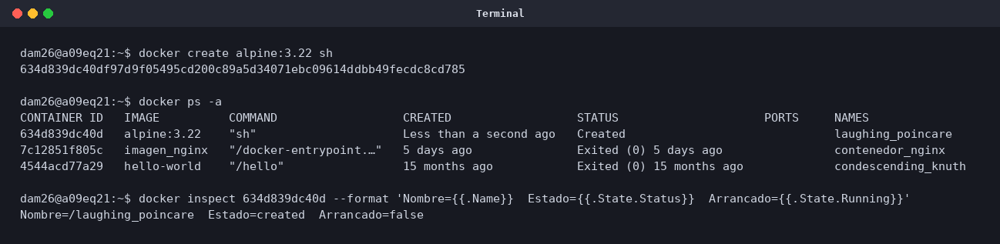

Se queda en estado Created, o sea que existe pero no tiene ningún proceso corriendo.
Por eso no sale en "docker ps", que solo muestra los que están funcionando.

El nombre se lo ha puesto Docker solo, nos ha puesto laughing_poincare. Estos nombres
son aleatorios, por eso mejor siempre ponerlo con --name.

## 3. Crear y arrancar dam_alp1

Ponemos "docker run -dit --name dam_alp1 alpine:3.22 sh".

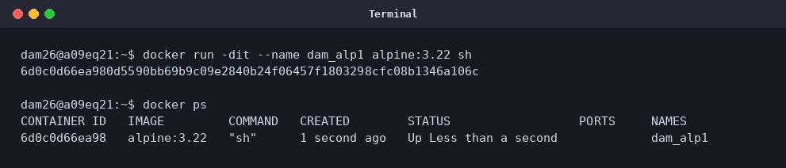

Para poder escribir dentro hacen falta la -i, para que no se corte el teclado, y la -t,
para que nos de una terminal. La -d es para que se quede funcionando detrás.

## 4. Ver la IP y hacer ping a google.com

Entramos con "docker exec -it dam_alp1 sh" y dentro ponemos "ip -4 addr show eth0".

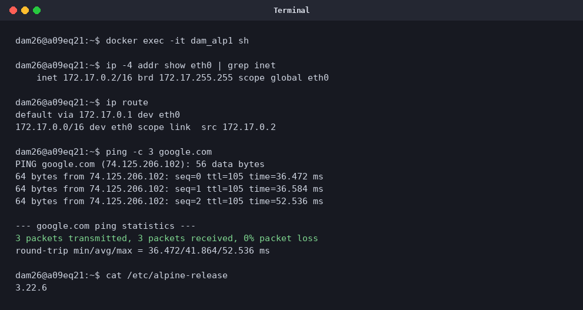

La IP es 172.17.0.2. El ping a google.com va bien, con 0% de pérdida, así que tiene
salida a internet.

## 5. dam_alp2 y pings entre los dos

Creamos el otro igual, con "docker run -dit --name dam_alp2 alpine:3.22 sh". El primero
tiene la IP 172.17.0.2 y el segundo la 172.17.0.3.

Por la IP va bien, poniendo "docker exec -it dam_alp1 ping -c 2 172.17.0.3".

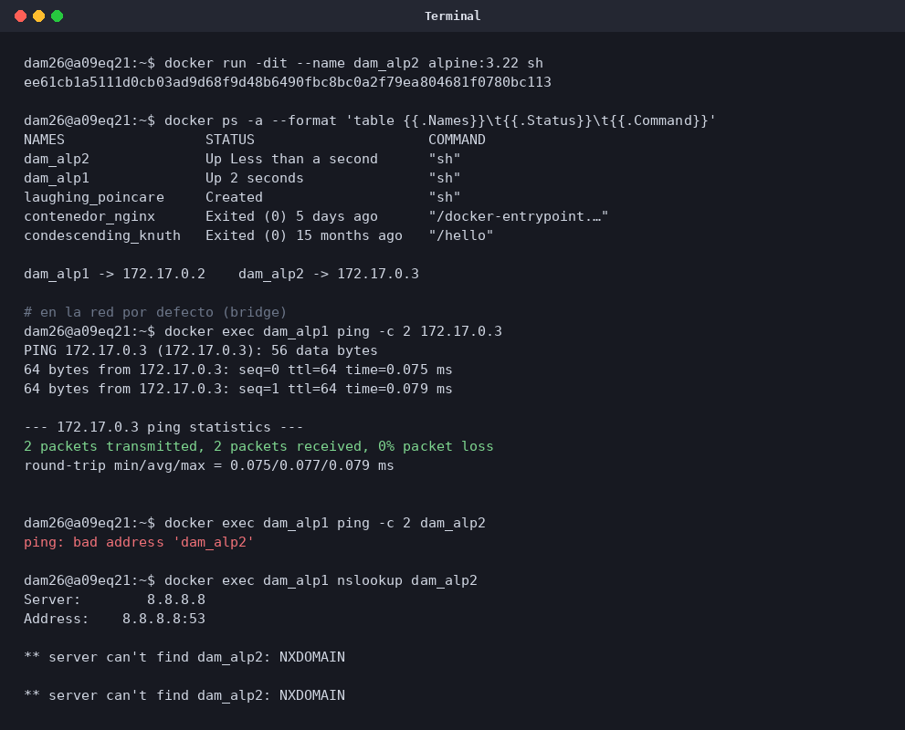

Por el nombre no va, da "ping: bad address 'dam_alp2'". Es que la red que viene por
defecto no tiene servidor de nombres, así que ping no sabe qué IP es dam_alp2. Lo
comprobamos con "docker exec -it dam_alp1 nslookup dam_alp2", que pregunta al
8.8.8.8 y le contesta NXDOMAIN, porque ese es el DNS de internet y no sabe nada de
nuestros contenedores.

La solución es crear una red nuestra con "docker network create --driver bridge
dam_red_dam" y conectar los dos con "docker network connect dam_red_dam dam_alp1".

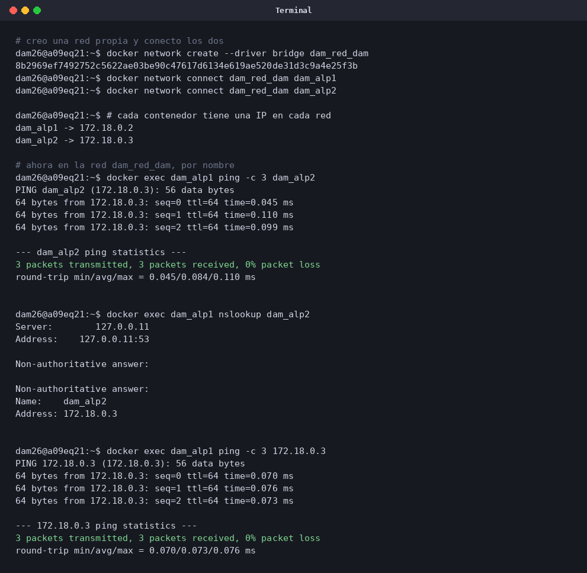

Ahora sí va por el nombre, porque en esta red Docker mete un DNS en 127.0.0.11 que ya
sabe los nombres. Y por la IP también va, más la vuelta desde el otro contenedor.

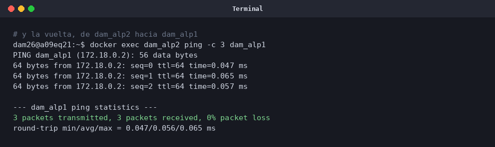

## 6. Cuánta memoria consumen

Sí, hay comando, que es "docker stats --no-stream".

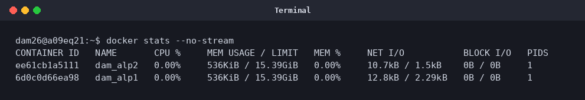

Cada uno está en unos 536 KiB, porque Alpine es una distribución muy pequeña y lo
único que está vivo es la shell.

## 7. Salir con exit

Salimos de la shell escribiendo exit y luego miramos "docker ps".

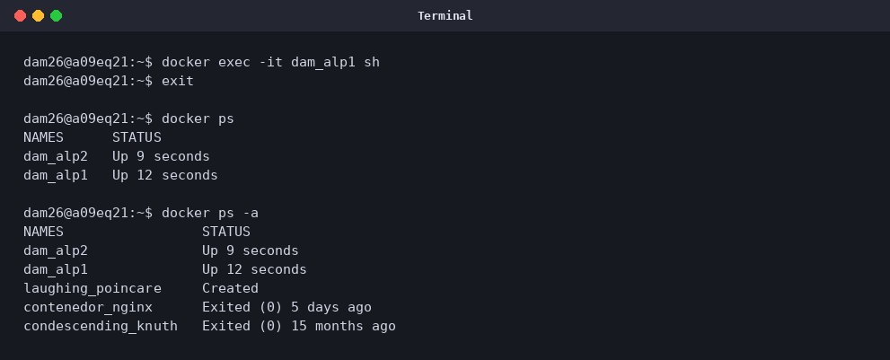

Los contenedores siguen funcionando, porque esa shell la abrió un "docker exec", que
es un proceso aparte, y el proceso principal del contenedor no se ha tocado.

Para ver el otro caso hice un contenedor sin el -d, con "docker run -it --name
dam_alp_attached alpine:3.22 sh". Aquí la shell es el proceso número 1, que lo vemos
con "echo $$".

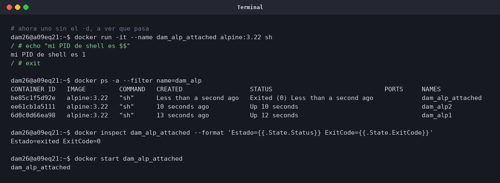

Al hacer exit aquí el contenedor se para entero y sale como Exited (0). O sea que exit
no para el contenedor, para el proceso principal. Y como aquí la shell es ese proceso,
al salir se para todo. En "docker ps" ya no sale, solo en "docker ps -a", y se puede
volver a encender con "docker start".

## 8. Cuánto disco hemos ocupado

Con "docker system df" sale el resumen.

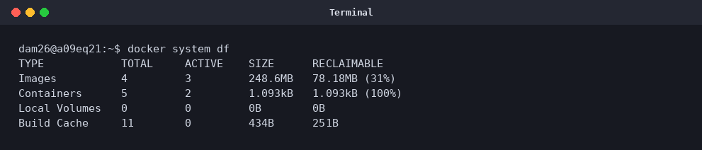

Y con "docker system df -v" el detalle.

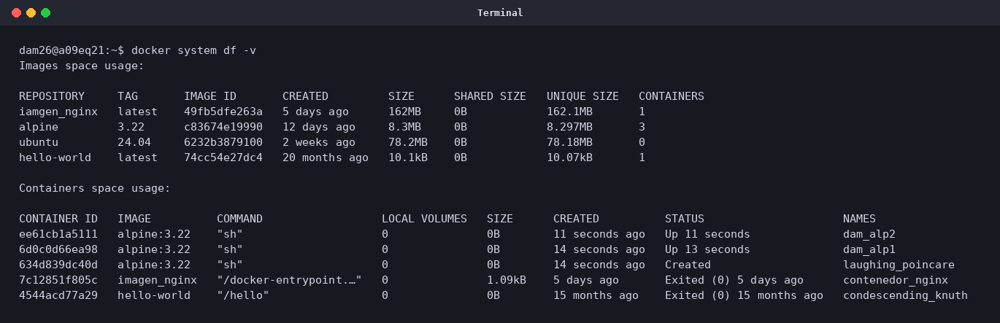

Una imagen es una plantilla y un contenedor es uno que ya corre con esa plantilla. Lo
que ocupa el disco es la imagen.

Aquí las imágenes ocupan 248,6 MB, pero de esta práctica solo son 8,3 MB, lo de Alpine.
Los contenedores ocupan 1.093 kB, o sea nada, y los de Alpine salen con 0B porque no
escribimos nada dentro. Con "docker ps -a --size" sale 0B (virtual 8.3MB), o sea que
los 8.3 MB son los de la imagen y se guardan una sola vez, no una por contenedor.

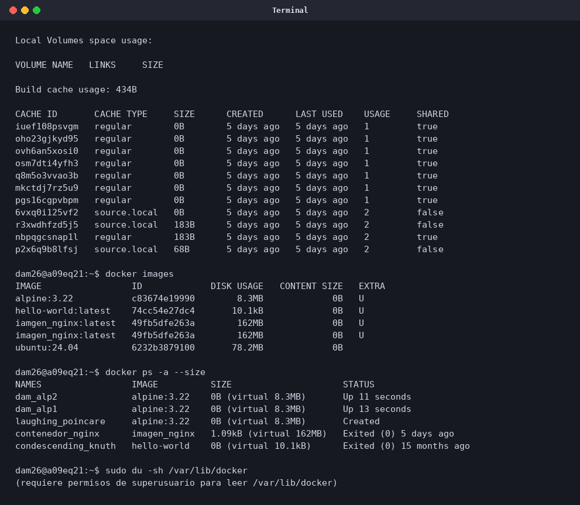
